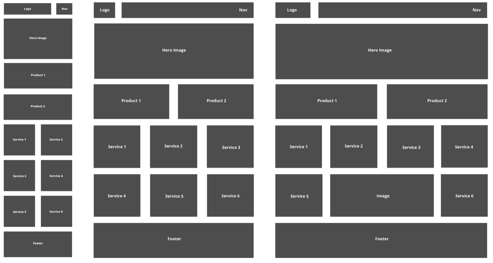

# Responsive Scaffold
This is a project about building a Responsive grid system & template.

## Installation 💻
No installation required, simply download the zip file and extract.
## Usage
This can be used as a template to design websites. Edit and add more content & styles in an text editor such as VSCode. View the results on your browser.

## Contributing 
1. Fork it!
2. Create your feature branch: `git checkout -b my-new-feature`
3. Commit your changes: `git commit -am 'Add some feature'`
4. Push to the branch: `git push origin my-new-feature`
5. Submit a pull request :D

## History
TODO: Write history
ß
## Credits
Russell
## License
MIT License
